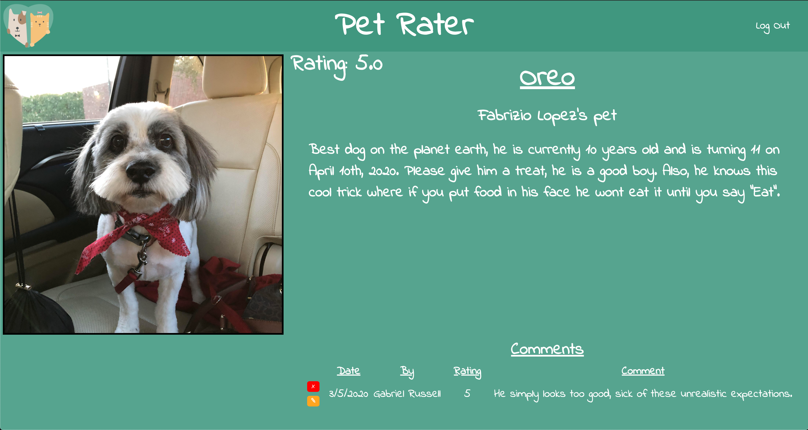

# Pet Rater

## Description
An app for rating other peoples pets or uploading your own pet and having it rated.

## Screenshots
### Landing Page

### Main Page

### Profile Page

## Technologies Used
- JavaScript
- HMTL
- CSS
- Node
- Express
- MongoDB
- Mongoose
- Google Oauth

## Getting Started
- [Pet Rater](https://pet-rater.herokuapp.com/)
- [Trello Board](https://trello.com/b/aTfWnbbf/pet-rater)

## Next Steps
- Allow users to sort the main page by rating, alphabetical, etc.
- Allow users to have a profile that displays all pets linked to them.

